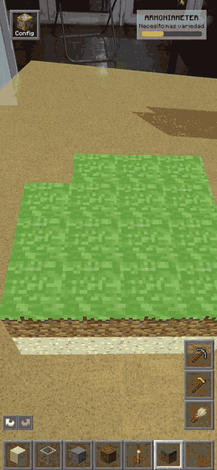
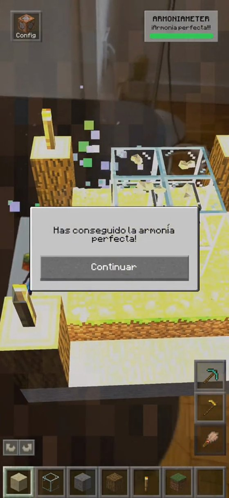

<!-- markdownlint-disable MD013 MD060 -->

# ARmonia

Sandbox de realidad aumentada para Android. Construyes un jardín zen colocando bloques voxel sobre las superficies reales que detecta la cámara del móvil.

Hay seis tipos de bloque —arena, piedra, madera, cristal, hierba y antorchas— más piedritas decorativas generadas por procedimiento. La arena cae si se queda sin apoyo debajo. Una barra puntúa el jardín en tiempo real según variedad, cantidad y decoración, y avisa cuando llega al máximo.

La pantalla de inicio funciona con la cámara frontal y hace dos cosas a la vez: Face Tracking te pone una cabeza de Creeper, y Hand Tracking con MediaPipe te deja elegir el modo de juego con un pellizco de los dedos, o dejando el cursor tres segundos sobre el botón si el pellizco falla.

| Dato | Valor |
|------|-------|
| **Hardware de referencia** | Samsung Galaxy S24 Ultra |
| **Motor** | Unity 6 (6000.0.66f2) |
| **Pipeline** | Universal Render Pipeline (URP), OpenGLES3 |
| **AR** | AR Foundation 6.0.6 + ARCore XR Plugin 6.0.6 |
| **Input** | Enhanced Touch (Input System 1.17.0) |
| **Extras** | NativeGallery (capturas), MediaPipe Unity Plugin 0.16.3 (manos y cara) |
| **Bundle ID** | `com.Gabiz.ARmonia` |
| **Versión** | 0.3.0 |

## Cómo abrirlo

1. Instala **Unity 6** (6000.0.66f2 o superior) con Android Build Support, AR Foundation y URP.
2. Clona el repositorio y ábrelo desde Unity Hub.
3. Escena de inicio: `Assets/_Project/Scenes/Title_Screen.unity` (build index 0). Escena de juego: `Main_AR.unity` (index 1).
4. Build target Android, sobre un dispositivo compatible con ARCore.

Los pasos completos, con los ajustes de Project Settings, están en la [documentación técnica](docs/documentacion-tecnica.md#1-cómo-abrir-el-proyecto).

## Qué hay dentro

Lo que más trabajo llevó no fue colocar bloques, sino que la escena aguante. La construcción usa una rejilla con reserva de celda, porque sin ella un doble toque rápido metía dos bloques en el mismo sitio. La gravedad de la arena se dispara por evento en vez de comprobarse cada frame, con un barrido de seguridad cada segundo por si algún evento se pierde. El deshacer y rehacer son un patrón Command con la pila limitada a veinte pasos.

La rejilla visual es una malla generada en tiempo de ejecución con desvanecido radial y sin asignaciones de memoria por frame, que era el punto donde más se notaba el tirón en el móvil.

El sistema de armonía es completamente reactivo: tres pilares, una puerta de mínimos y ningún sondeo. La barra, las frases y el panel final escuchan eventos.

## Documentación técnica

El detalle está en [`docs/documentacion-tecnica.md`](docs/documentacion-tecnica.md): arquitectura, las dos escenas, los flujos de construcción y de gravedad, los shaders propios, el catálogo de los 75 scripts y el inventario de assets.

## Estado

Beta completa. Se puede jugar de principio a fin: los seis bloques, las herramientas, el modo foto, el guardado del jardín y los tres modos de mundo funcionan sobre el hardware de referencia.

## Contexto

Proyecto individual de la asignatura Sistemas Inmersivos del Doble Máster en Ingeniería Informática e Inteligencia Artificial Aplicada de la UC3M, desarrollado entre febrero y marzo de 2026.

## Licencia y assets

El código de este repositorio es de autoría propia y se puede reutilizar citando la fuente.

El proyecto incluye material que no lo es: paquetes de terceros (MediaPipe Unity Plugin, NativeGallery, el plugin de vibración), y assets gráficos y sonoros de estilo Minecraft. Por eso el repositorio no lleva un archivo de licencia global: publicarlo bajo MIT equivaldría a afirmar que todo lo que hay dentro se puede redistribuir libremente, y no es el caso. Cada componente de terceros se rige por la licencia de su titular.

Se publica como pieza de portafolio, para que se pueda leer el código y la arquitectura.
